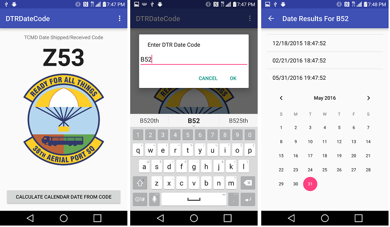

# DTRDateCode
Android app for calculating TCMD date shipped and received codes

## Purpose

DTRDateCode is a simple Android mobile app that calculates the date shipped and received codes used on advanced Transportation Control and Movement Documents as specified in USTRANSCOM Defense Transportation Regulation (DTR) - Part II (Cargo Movement) Appendix RR (Date Shipped and Received Codes) dated May 2014 which can be downloaded from http://www.ustranscom.mil/dtr/part-ii/dtr_part_ii_app_rr.pdf. 

The app can be configured (via settings) to calculate surface conveyance date codes in accordance with paragraph B (including the 4-digit codes used for ocean conveyance), and air conveyance hour/day codes in accordance with paragraph C. For air conveyance hour codes, the program takes into account the local timezone. In addition, the app can reverse-calculate dates from an existing date code.
